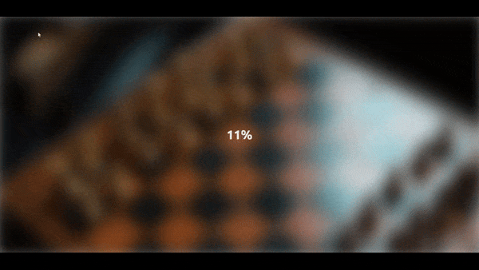

# Blurry Loading Effect

## 🚀 Overview

This project creates a "Blurry Loading Effect" where an image gradually comes into focus as a loading percentage increases from 0% to 100%. It's a visually engaging way to enhance the loading experience on web pages.

### 🎯 Project Goals:
- Begin with a blurry image at 0% and progressively bring it into focus as the load reaches 100%.
- Map different number ranges to the 0-100% loading scale.
- Start the image blur at 30px and reduce it to 0px as the loading progresses.
- Implement a Stack Overflow function to map one number range to another for smooth transitions.

## 🛠️ Built With

- [HTML5](https://www.w3schools.com/html/)
- [CSS3](https://www.w3schools.com/css/)
- [JavaScript](https://www.w3schools.com/js/)
